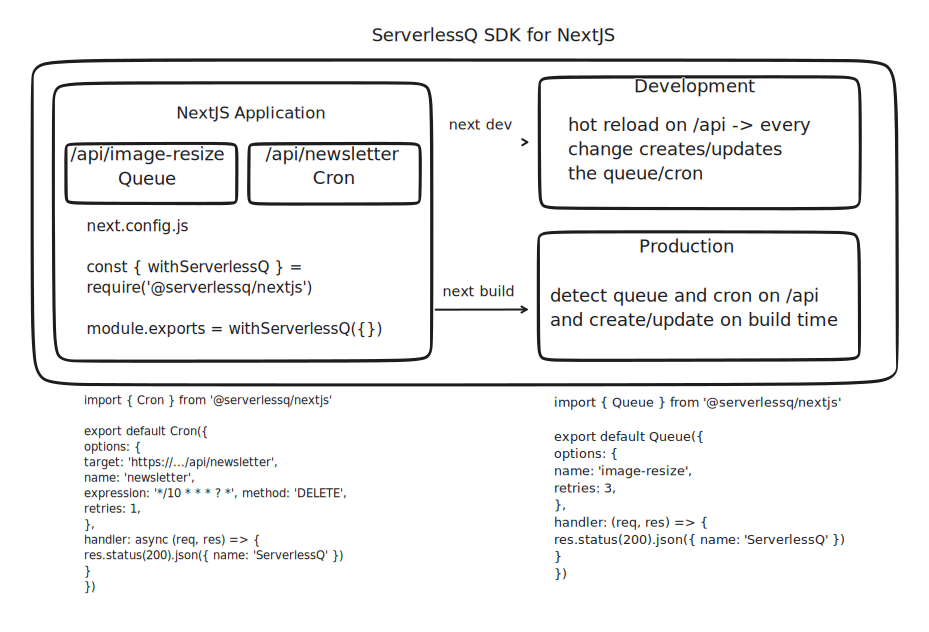

<p align="center">
  <a aria-label="NPM version" href="https://www.npmjs.com/package/@serverlessq/nextjs">
    
  </a>
  <a aria-label="Package size" href="https://bundlephobia.com/result?p=@serverlessq/nextjs">
    
  </a>
  <a aria-label="License" href="https://github.com/vercel/swr/blob/main/LICENSE">
    
  </a>
</p>

## Introduction

`@ServerlessQ/nextjs` is a lightweight wrapper to easily utilize the managed queue by [ServerlessQ](https://serverlessq.com).

The SDK is for NextJS projects deployed on Vercel and makes use of Vercel environment variables.

ServerlessQ lets you easily create **Message Queues** and **Cron Jobs** to truly build asynchronous systems.

---

**View full documentation and examples on [docs.serverlessq.com](https://docs.serverlessq.com).**

<br/>

## Installation

Install the library through your desired package manager

```
yarn add @serverlessq/nextjs
```

```
npm i @serverlessq/nextjs
```

```
pnpm i @serverlessq/nextjs
```

<br/>

This library gives you easy access for using [ServerlessQ](https://serverlessq.com).

## Environment Variables

You need to set the `SERVERLESSQ_API_TOKEN` to have access to the system.

1. Create an account at [app.serverlessq.com](https://app.serverlessq.com) and follow the steps described in our [documentation](https://docs.serverlessq.com/sdks/javascript) to get the API token.

> 🔜 you can also use our Vercel Integration to automate that task 🙂

If you want to use this library locally please create `.env.local` file with the following value:

```bash
SERVERLESSQ_API_TOKEN=
```

New for you? Go check out the official next.js docs on [how to create env files in NextJS](https://nextjs.org/docs/basic-features/environment-variables)

<br/>

## Create a Queue from an API Function

Create a new [API Route](https://nextjs.org/docs/api-routes/introduction) within your NextJS application, e.g. `pages/api/queue`.

You can have several queues in multiple queue functions.

```ts
// pages/api/queue
export default Queue(
  "SendNewsletter" // Name of the queue,
  "api/queue" // Path to this queue,
  async (req, res) => { // Handler function. This will be executed once you enqueue a job.
    const result = await doSomethingImportant();
    console.log("Queue Job", result);
    res.send("finished");
  },
  { retries: 1, urlToOverrideWhenRunningLocalhost: "https://mock.codes/201" } // Additional optional options
);
```

<br/>

### Enqueue Jobs

You can now easily enqueue jobs by importing your created queue and simple call `.enqueue(...)`.

You can do this either from `getServerSideProps` or from another API function.

```ts
// pages/api/enqueue or getServerSideProps
import { NextApiRequest, NextApiResponse } from 'next'
import testQueue from './queue'

export default async function enqueue(
  req: NextApiRequest,
  res: NextApiResponse
) {
  try {
    const result = await testQueue.enqueue({ method: 'GET' })
    res.json({ status: 'success', ...result })
  } catch (e) {
    res.json({ status: 'failed' })
  }
}
```

## Types

We have full TypeScript support of course ✨

## Local Development

ServerlessQ runs on the cloud. That means if you work locally on a queue and want to test enqueueing jobs you need to override the parameter `urlToOverrideWhenRunningLocalhost` in the queue options.
This url will only be used if the environment variable `VERCEL` is not set. You can use a service such as [ngrok](https://ngrok.com/). Ngrok gives you a deployed
Webhook URL and you can run a local CLI which listens to all of these incoming requests. This is a great way to test your queue.

If you need help with that please contact us! 💬

## Working with Existing Queues

You have also the opportunity to work with existing queues. If you have created a queue from the ServerlessQ UI and simply want to forward messages you can do that.

```ts
// pages/api/existingQueue
import { enqueue } from "@serverlessq/nextjs";
import { NextApiRequest, NextApiResponse } from "next";

export default async function handler(
  _req: NextApiRequest,
  res: NextApiResponse
) {
  try {
    const result = await enqueue({
      target: // TARGET URL,
      method: // HTTP METHOD,
      queueId: // QUEUE-ID,
    });
    res.json({ status: "success", ...result });
  } catch (e) {
    res.json({ status: "failed" });
  }
}
```

You can use the `enqueue` function to directly enqueue a job to a certain `Queue-ID`.

## Milestone

- [x] Enqueue messages with ServerlessQ
- [x] Build Wrapper for NextJS API Routes
- [x] Allow dynamic queue creation
- [ ] Add the option for advanced queue options e.g. filter, tags

<br/>

## License

The MIT License.
